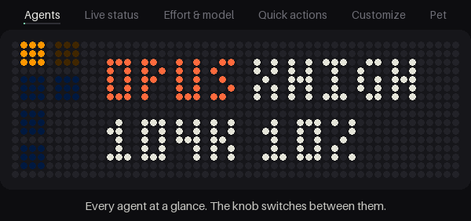

# pixbar

**A little control panel for your Claude Code agents, on a 52×16 LED gadget.**

<p align="center">
  
</p>

pixbar turns an Ulanzi TC002 ("Pixbar": 52×16 LEDs, a knob, three buttons) into a companion for the Claude Code
agents you run in [herdr](https://herdr.dev).

- **Every agent at a glance.** One block per agent, coloured by status; the ones that need you (blocked, or done
  and not looked at yet) breathe.
- **Switch with the knob.** herdr's focus follows, like Tab.
- **Effort and model from the buttons.** Low to max and ultracode; Opus ↔ Fable, or any models you list.
- **A menu for the rest.** Compact or clear, rename the tab, split, close.
- **The readouts you want.** Model and effort, context, the session's name, the account's 5-hour and 7-day usage,
  cost.
- **A dango**, if you like, that lives in the dark corners of the screen and acts out what the focused agent is
  doing.

Nothing is flashed: pixbar runs from the panel's RAM, and switching the panel off and on brings Ulanzi's firmware
back.

## Requirements

- An Ulanzi **TC002** (not the TC001), on your WiFi (set up once with Ulanzi's app) or on a USB cable
- [herdr](https://herdr.dev) with its Claude Code integration: `herdr integration install claude`
- Rust 1.87+ from [rustup](https://rustup.rs) (it fetches the ARM target by itself)
- Linux or macOS

## Quick start

```sh
cargo build --release
target/release/pixbar-bridge install   # into ~/.local/bin, a line in your status line script, a login service
pixbar-bridge deploy usb               # or: deploy <the panel's IP>. Once per panel
pixbar-bridge doctor                   # checks every link from Claude Code to the panel
```

From then on, switching the panel on is all it takes: the service finds it and starts pixbar on it.

No panel yet? `cargo run -p pixbar-sim -- --pet mint` runs the whole thing in a window (up / down: knob, Enter:
push, hold Enter: settings, left / right: effort, space: model, B: change the agent's status).

## Controls

| | |
|---|---|
| **Knob** | the next / previous agent |
| **Knob push** | the menu: compact or clear, rename tab, split right or down, close tab or pane |
| **Knob long-press** | settings |
| **Left / right** | effort down / up |
| **Middle** | the next model (press again within 4 s to confirm) |

What cannot be taken back (compact, clear, close) also takes a second press. Nothing is typed into a session that
is waiting on a permission prompt, and `/compact` and `/clear` are refused in the middle of a turn.

## Settings

Long-press the knob, turn it for the page, left / right for the value. Kept on the panel.

| Page | |
|---|---|
| BRIGHT | 10–100 % |
| BLOCKS | the strip's block size: 6 to 32 agents |
| ROW 1, ROW 2 | model and effort, context (`104K 10%`, `104K` or `10%`), name, 5-hour or 7-day usage, cost |
| STYLE 1, STYLE 2 | plain, dim, card or tint |
| NAME | space, tab, both, directory, session title or `/rename` name |
| PET | off, or the dango in mint, pink, peach, lemon, sky or lilac |
| LINGER | how long a name stays up after a knob turn: 2–20 s |
| REFRESH | how often model, effort and context are re-read: 0.25–5 s |
| HOSTS | whose agents to show when several machines are connected |
| DEVICE | battery, WiFi, address, version |
| TURN OFF, STOCK FW | power off, or back to Ulanzi's firmware (two presses) |

The middle button steps between Opus and Fable; to step through others, list them in `~/.config/pixbar/models`,
one per line.

## More

- **[The guide](docs/guide.md):** how it works, what `install` changes, USB and networks, several machines,
  every control and setting in full, what goes over the network, battery, going back, troubleshooting, the
  simulator.
- **[The lab notebook](docs/research.md):** what was measured on the hardware, and why things are as they are.

## Credits

How the panel's LEDs and its MCU are driven was worked out by the people behind
[tc002-customisation](https://github.com/aquarat/tc002-customisation); pixbar uses those facts and none of their
code.

Not affiliated with, endorsed by or supported by Ulanzi or Anthropic. Ulanzi and TC002 are Ulanzi's names; Claude
and Claude Code are Anthropic's. [MIT](LICENSE).
