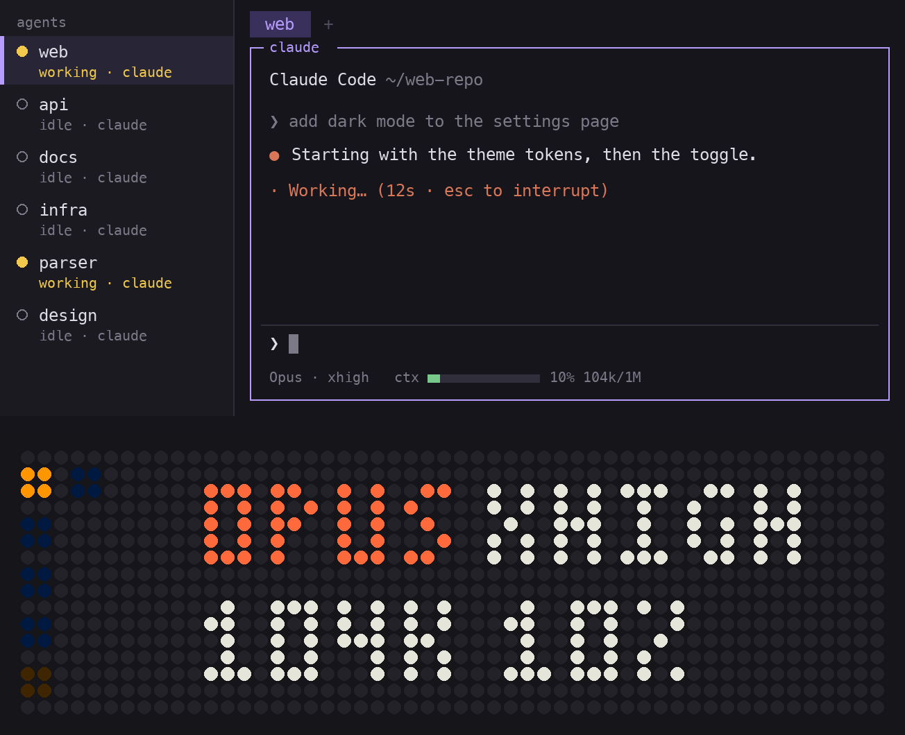
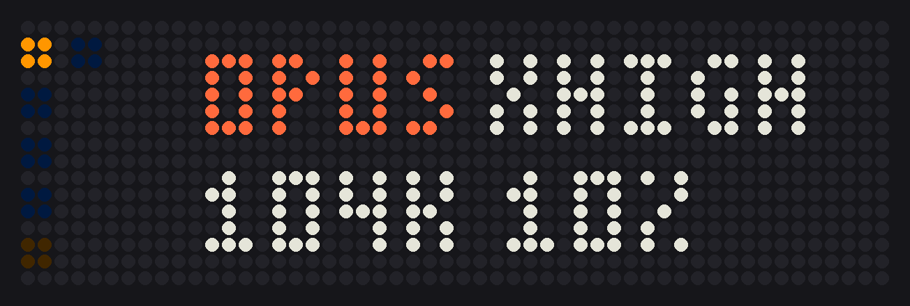
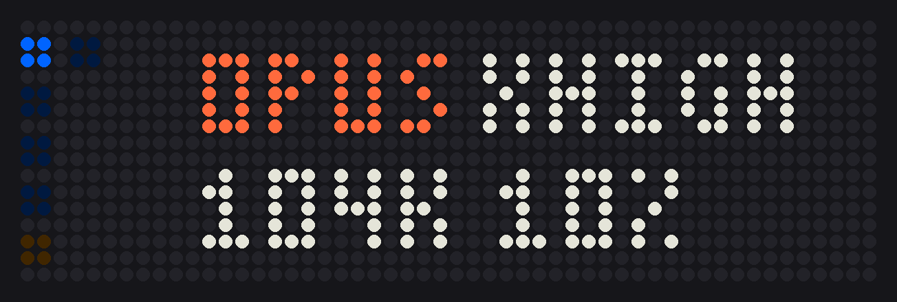
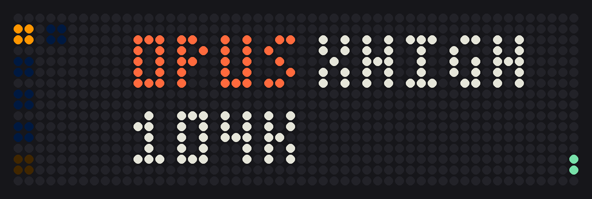

# herdr-deck

**A little control panel for your Claude Code agents, on a 52×16 LED gadget.**

herdr-deck turns an Ulanzi TC002 (sold as "Pixbar": 52×16 LEDs, a knob, three buttons) into a companion for the Claude Code
agents you run in [herdr](https://herdr.dev). Nothing is flashed: it runs from the panel's RAM, and switching the
panel off and on brings Ulanzi's firmware back.

## What it does

### See every agent at a glance

One block per agent down the left, coloured by what it is doing: blue idle, orange working, red blocked, green
done. Turn the knob and herdr's focus moves to the next one, like Tab; the panel shows its name, then its model,
effort and context. It works the other way round too: move the focus in herdr and the panel follows.



### Follow them live

Model, effort and context come straight from Claude Code's status line as they change, so you watch the context
climb while an agent works. The ones that need you, blocked or done and not looked at yet, breathe in the strip
until you get to them.


### Change effort and model with a press

Left and right step the effort from low to max and on to ultracode. The middle button switches between Opus and
Fable, or whichever models you list; since a switch has the whole context read again, it asks for a second press
first.



### Quick actions from a menu

Push the knob for a menu on the agent in front of you: compact or clear the conversation, rename its herdr tab,
split its pane right or down, close the tab or the pane. What cannot be taken back asks for a second press.



### Make it yours

Pick what the two rows show (model and effort, context, the session's name, the account's 5-hour or 7-day usage,
the cost), how each row is drawn, how big the blocks are and how bright, all in the settings on the panel itself.


### Adopt a dango

A round little dumpling moves into the panel's dark corners and acts out the agent in front of you: it hums while
the agent works, munches as the context grows, startles when it is blocked, beams when it is done and falls asleep
when it idles. Pick its colour in the settings, or leave it off.



## Requirements

- An Ulanzi **TC002** (not the TC001), on your WiFi (set up once with Ulanzi's app) or on a USB cable
- [herdr](https://herdr.dev) with its Claude Code integration: `herdr integration install claude`
- Rust 1.87+ from [rustup](https://rustup.rs) (it fetches the ARM target by itself)
- Linux or macOS

## Quick start

```sh
cargo build --release
target/release/herdr-deck install   # into ~/.local/bin, a line in your status line script, a login service
herdr-deck deploy usb               # or: deploy <the panel's IP>. Once per panel
herdr-deck doctor                   # checks every link from Claude Code to the panel
```

From then on, switching the panel on is all it takes: the service finds it and starts herdr-deck on it.

No panel yet? `cargo run -p herdr-deck-sim -- --pet mint` runs the whole thing in a window (up / down: knob, Enter:
push, hold Enter: settings, left / right: effort, space: model, B: change the agent's status).

## Controls

| | |
|---|---|
| **Knob** | the next / previous agent |
| **Knob push** | the menu: compact or clear, rename tab, split right or down, close tab or pane |
| **Knob long-press** | settings |
| **Left / right** | effort down / up |
| **Middle** | the next model (press again within 4 s to confirm) |

What cannot be taken back (compact, clear, close) also takes a second press. Nothing is typed into a session that
is waiting on a permission prompt, and `/compact` and `/clear` are refused in the middle of a turn.

## Settings

Long-press the knob, turn it for the page, left / right for the value. Kept on the panel.

| Page | |
|---|---|
| BRIGHT | 10–100 % |
| BLOCKS | the strip's block size: 6 to 32 agents |
| ROW 1, ROW 2 | model and effort, context (`104K 10%`, `104K` or `10%`), name, 5-hour or 7-day usage, cost |
| STYLE 1, STYLE 2 | plain, dim, card or tint |
| NAME | space, tab, both, directory, session title or `/rename` name |
| PET | off, or the dango in mint, pink, peach, lemon, sky or lilac |
| LINGER | how long a name stays up after a knob turn: 2–20 s |
| REFRESH | how often model, effort and context are re-read: 0.25–5 s |
| HOSTS | whose agents to show when several machines are connected |
| DEVICE | battery, WiFi, address, version |
| TURN OFF, STOCK FW | power off, or back to Ulanzi's firmware (two presses) |

The middle button steps between Opus and Fable; to step through others, list them in `~/.config/herdr-deck/models`,
one per line.

## More

- **[The guide](docs/guide.md):** how it works, what `install` changes, USB and networks, several machines,
  every control and setting in full, what goes over the network, battery, going back, troubleshooting, the
  simulator.
- **[The lab notebook](docs/research.md):** what was measured on the hardware, and why things are as they are.

## Credits

How the panel's LEDs and its MCU are driven was worked out by the people behind
[tc002-customisation](https://github.com/aquarat/tc002-customisation); herdr-deck uses those facts and none of their
code.

Not affiliated with, endorsed by or supported by Ulanzi or Anthropic. Ulanzi and TC002 are Ulanzi's names; Claude
and Claude Code are Anthropic's. [MIT](LICENSE).
